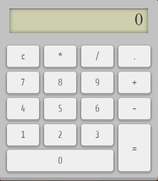
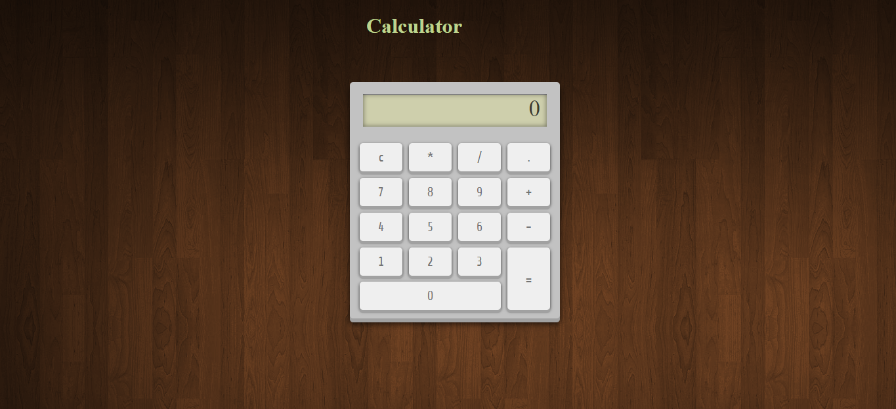
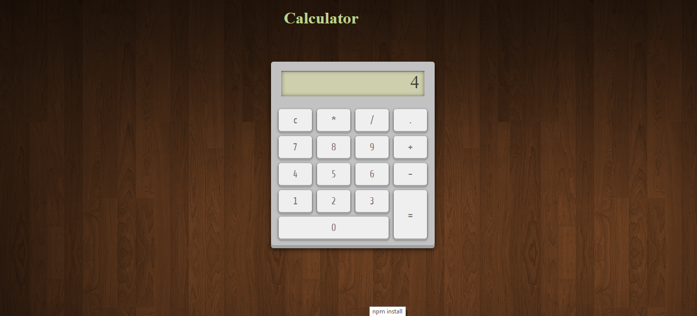

<!-- MAde by @GeorgeET15 -->
<!-- PROJECT LOGO -->
<br />
<p align="center">
  <a href="https://github.com/GeorgeET15/Video-Downloader-Website">
    
  </a>

  <h1 align="center">Calculator-app</h1>

  <p>
    <h2 align="center"> A simple calculator with the basic functions.This app is used to solve math problems.</h2>
</p>

<p align="center">
  <a href="https://github.com/GeorgeET15/Video-Downloader-Website">
    
  </a>

### Technologies Used

- HTML
- CSS [style/Presentation]
- Javascript [Logic/Working of calculator]

<!-- GETTING STARTED -->
## Getting Started

Follow these steps to quickly setup your Calculator.
  
### Prerequisites

This is an example of how to list things you need to use the Calculator
  
 * clone the project
  
  ```sh
  git clone https://github.com/anushruti11/Calculator-app.git
  ```
## Usage

 - After installing run the index.html file
  
 - Now you can use the Calculator App
  
  <a href="https://github.com/GeorgeET15/Video-Downloader-Website">
    
  </a>
  <a href="https://github.com/GeorgeET15/Video-Downloader-Website">
     
   </a>
  
<!-- CONTRIBUTING -->
## Contributing

Contributions are what make the open source community such an amazing place to learn, inspire, and create. Any contributions you make are **greatly appreciated**.

1. Fork the Project
2. Create your Feature Branch (`git checkout -b feature/AmazingFeature`)
3. Commit your Changes (`git commit -m 'Add some AmazingFeature'`)
4. Push to the Branch (`git push origin feature/AmazingFeature`)
5. Open a Pull Request

<!-- CONTACT -->
## Contact

Project Link: [https://github.com/anushruti11/Calculator-app.git](https://github.com/anushruti11/Calculator-app.git)
